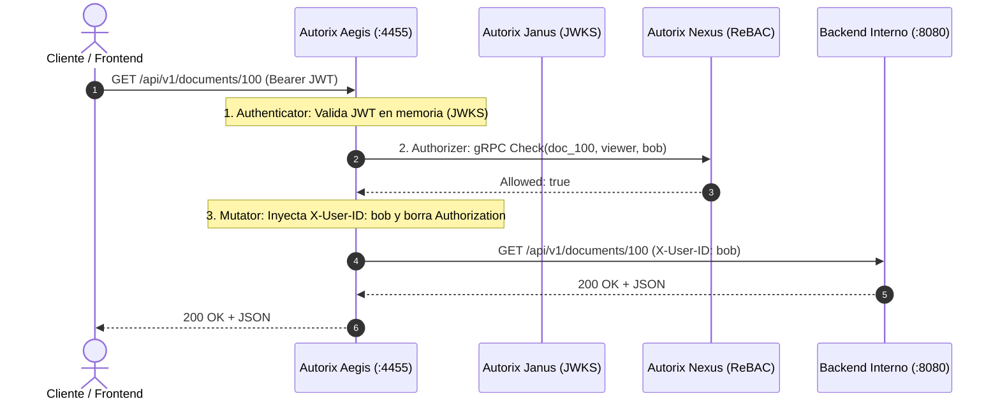

# Guía de Uso para Desarrolladores: Autorix Aegis

**Autorix Aegis** es el Zero Trust Identity & Access Proxy (equivalente a ORY Oathkeeper) del ecosistema Autorix.

---

## 1. ¿Cómo Funciona Aegis?

Aegis se ubica frente a tus microservicios de backend (`:4455`) para que **ninguno de tus servicios internos tenga que programar lógica de autenticación o parsing de JWTs**.



---

## 2. Configuración de Reglas Declarativas (`rules.yaml`)

Las reglas definen cómo Aegis protege cada ruta de tu infraestructura:

```yaml
- id: "rule-documents-api"
  description: "Protege el microservicio de documentos"
  match:
    url: "/api/documents/<[0-9]+>"
    methods: ["GET", "POST"]
  
  # 1. Autenticación: Valida JWT
  authenticators:
    - handler: "jwt"
  
  # 2. Autorización: Consulta a Nexus ReBAC
  authorizer:
    handler: "nexus_rebac"
    config:
      namespace: "document"
      relation: "viewer"
  
  # 3. Mutación: Inyecta datos limpios hacia el backend
  mutators:
    - handler: "header"
      config:
        headers:
          X-User-ID: "{{ .Subject }}"
          X-User-Scopes: "{{ range .Scopes }}{{ . }} {{ end }}"

  # 4. Destino
  upstream:
    url: "http://document-service:8080"
```

---

## 3. Handlers Disponibles

### Autenticadores
* `jwt`: Extrae y valida el token Bearer usando el JWKS de Janus en memoria.
* `anonymous`: Permite que peticiones públicas pasen sin token con sujeto `anonymous`.
* `noop`: No realiza ninguna verificación de identidad.

### Autorizadores
* `nexus_rebac`: Llama a Nexus gRPC (`:50051`) para evaluar permisos en el grafo.
* `allow`: Permite el acceso sin consultar.
* `deny`: Bloquea inmediatamente con `403 Forbidden`.

### Mutadores
* `header`: Inyecta cabeceras personalizadas (`X-User-ID`, `X-User-Scopes`) evaluadas con Go Templates sobre la sesión del usuario, y elimina el header `Authorization` original para cumplir con Zero Trust.
* `noop`: Pasa las cabeceras originales intactas.

---

## 4. Puesta en Marcha con Docker Compose

```bash
docker compose up --build
```

El proxy quedará expuesto en `http://localhost:4455`.
Cualquier petición que envíes a `http://localhost:4455/api/...` será interceptada, validada y despachada hacia el backend configurado.
