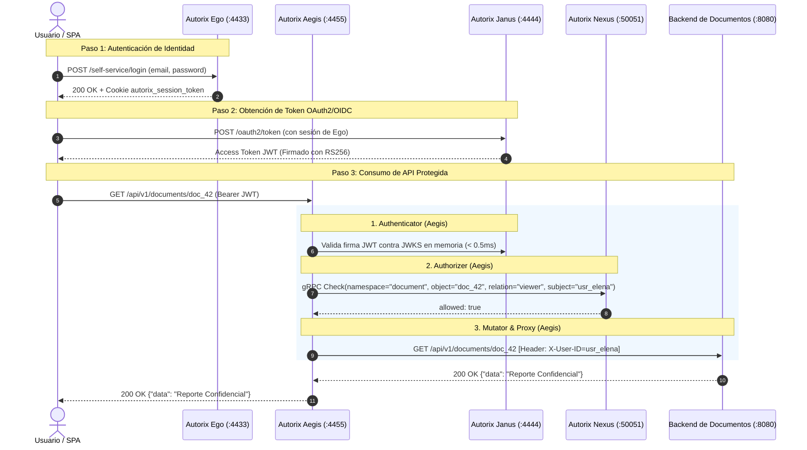
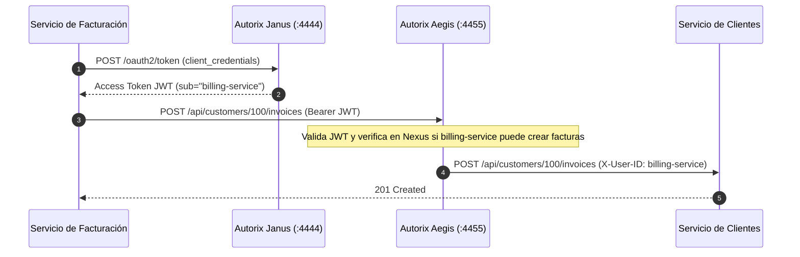

# Manual Maestro de Integración y Referencia de APIs: Suite Autorix

Este documento es la referencia técnica definitiva para arquitectos e ingenieros que deseen integrar **Autorix** en su infraestructura de microservicios y aplicaciones cliente (Frontend, Backend, Móvil, Scripts M2M y Enterprise IdPs).

---

# Tabla de Contenidos
1. [Visión Global y Matriz de Puertos](#1-visión-global-y-matriz-de-puertos)
2. [Referencia Completa de APIs por Servicio](#2-referencia-completa-de-apis-por-servicio)
   - [2.1 Autorix Nexus (ReBAC + ABAC)](#21-autorix-nexus-rebac--abac)
   - [2.2 Autorix Ego (Identidad y Sesiones)](#22-autorix-ego-identidad-y-sesiones)
   - [2.3 Autorix Janus (OAuth2 & OIDC)](#23-autorix-janus-oauth2--oidc)
   - [2.4 Autorix Aegis (Zero Trust Proxy)](#24-autorix-aegis-zero-trust-proxy)
   - [2.5 Autorix Vulcan (API Keys & Macaroons)](#25-autorix-vulcan-api-keys--macaroons)
   - [2.6 Autorix Hermes (SAML 2.0 & SCIM 2.0)](#26-autorix-hermes-saml-20--scim-20)
3. [Cómo Trabajan Todos Juntos (Flujos End-to-End)](#3-cómo-trabajan-todos-juntos-flujos-end-to-end)
   - [Flujo 1: Inicio de Sesión y Acceso a APIs con Aegis](#flujo-1-inicio-de-sesión-y-acceso-a-apis-con-aegis)
   - [Flujo 2: M2M con Client Credentials y Verificación ReBAC](#flujo-2-m2m-con-client-credentials-y-verificación-rebac)
   - [Flujo 3: Single Sign-On Empresarial (Okta -> Hermes -> Ego -> Janus)](#flujo-3-single-sign-on-empresarial-okta---hermes---ego---janus)
4. [Guía de Integración para Nuevos Microservicios](#4-guía-de-integración-para-nuevos-microservicios)
   - [Patrón de Backend Seguro (Go / Node.js / Python)](#patrón-de-backend-seguro-go--nodejs--python)
   - [Patrón de Frontend SPA (React / Next.js)](#patrón-de-frontend-spa-react--nextjs)

---

# 1. Visión Global y Matriz de Puertos

| Servicio | Puerto | Protocolo | Tipo de Tráfico | Propósito |
| :--- | :--- | :--- | :--- | :--- |
| **Aegis** | `4455` | HTTP/1.1 | **Público / Edge** | Punto de Entrada Único (PEP) / Reverse Proxy |
| **Ego** | `4433` | HTTP REST | Público / Interno | Registro, Login, Recuperación y `/sessions/whoami` |
| **Janus** | `4444` | HTTP REST / OIDC | Público / Interno | Emisión de Tokens JWT, OIDC Discovery y JWKS |
| **Nexus** | `50051` | gRPC | **Estrictamente Interno** | Evaluación de Grafo de Permisos ReBAC/ABAC (< 5ms) |
| **Vulcan** | `4466` | HTTP REST | Interno / SDK | Creación de API Keys y Verificación de Macaroons |
| **Hermes** | `4477` | HTTP REST / XML | Público / IdP | Endpoint SAML ACS y Servidor SCIM 2.0 |

---

# 2. Referencia Completa de APIs por Servicio

---

## 2.1 Autorix Nexus (ReBAC + ABAC)
* **Protocolo:** gRPC (Protobuf v1)
* **Host:** `nexus:50051`

### RPC `Check`
Evalúa si un sujeto tiene una relación con un objeto, evaluando condiciones CEL (ABAC).

* **Firma Proto:** `rpc Check(CheckRequest) returns (CheckResponse);`
* **Request:**
```json
{
  "namespace": "document",
  "object": "payroll_2026_q1",
  "relation": "viewer",
  "subject_namespace": "user",
  "subject_id": "usr_9988",
  "request_context": {
    "ip": "192.168.1.100",
    "mfa_active": true
  }
}
```
* **Response:**
```json
{
  "allowed": true,
  "reason": "direct match"
}
```

---

## 2.2 Autorix Ego (Identidad y Sesiones)
* **Host:** `http://localhost:4433`

### `POST /self-service/registration`
* **Descripción:** Registra un nuevo usuario, hashea la contraseña con Argon2id y emite la sesión inicial.
* **Request:**
```json
{
  "traits": {
    "email": "elena.rostova@autorix.io",
    "name": { "first": "Elena", "last": "Rostova" }
  },
  "password": "SecurePassword#2026!"
}
```
* **Response (`201 Created`):**
```json
{
  "identity": {
    "id": "e47ac10b-58cc-4372-a567-0e02b2c3d479",
    "schema_id": "default",
    "traits": {
      "email": "elena.rostova@autorix.io",
      "name": { "first": "Elena", "last": "Rostova" }
    },
    "state": "active"
  },
  "session": {
    "id": "d1c2b3a4-1111-2222-3333-444455556666",
    "token": "4a7b9c1d...", 
    "expires_at": "2026-09-15T15:00:00Z"
  }
}
```
*(Inyecta cookie HTTP-Only `autorix_session_token`).*

### `POST /self-service/login`
* **Request:** `{"identifier": "elena.rostova@autorix.io", "password": "SecurePassword#2026!"}`
* **Response (`200 OK`):** Devuelve la identidad y la nueva sesión.

### `GET /sessions/whoami`
* **Headers:** `Authorization: Bearer <session_token>` o Cookie `autorix_session_token`.
* **Response (`200 OK`):** Devuelve el objeto `Session` con los traits del usuario.

### `POST /self-service/logout`
* **Descripción:** Revoca la sesión en la base de datos y purga la cookie.

---

## 2.3 Autorix Janus (OAuth2 & OIDC)
* **Host:** `http://localhost:4444`

### `GET /.well-known/openid-configuration`
* **Descripción:** Metadata de descubrimiento OpenID Connect (JWKS URI, Token Endpoint, Algoritmos).

### `GET /.well-known/jwks.json`
* **Descripción:** Claves públicas RSA/ES256 activas para verificación en memoria.

### `POST /oauth2/token`
* **Header:** `Content-Type: application/x-www-form-urlencoded`
* **Flujo Client Credentials (M2M):**
  - Parámetros: `grant_type=client_credentials&client_id={id}&client_secret={secret}&scope={scopes}`
* **Flujo Authorization Code con PKCE:**
  - Parámetros: `grant_type=authorization_code&code={code}&code_verifier={verifier}&client_id={id}`
* **Response (`200 OK`):**
```json
{
  "access_token": "eyJhbGciOiJSUzI1NiIsImtpZCI6...",
  "token_type": "Bearer",
  "expires_in": 3600,
  "id_token": "eyJhbGciOiJSUzI1NiIs...",
  "scope": "openid profile email"
}
```

### `POST /admin/clients`
* **Descripción:** Registra una nueva aplicación cliente OAuth2.

---

## 2.4 Autorix Aegis (Zero Trust Proxy)
* **Host:** `http://localhost:4455`

Aegis intercepta todo el tráfico que entra a la red y aplica el pipeline configurado en `rules.yaml`:
1. **Verifica Autenticador (`jwt`, `anonymous`)**.
2. **Consulta a Nexus (`nexus_rebac`)** para validar que el sujeto tenga permiso.
3. **Muta Cabeceras (`header`)** inyectando `X-User-ID: <subject>` y eliminando tokens sensibles.
4. **Redirige al Upstream** (`upstream.url`).

---

## 2.5 Autorix Vulcan (API Keys & Macaroons)
* **Host:** `http://localhost:4466`

### `POST /keys`
* **Descripción:** Genera una nueva API key con prefijo `av_live_` y su Macaroon base.
* **Request:** `{"name": "Billing Service", "owner_id": "org_100", "is_live": true}`

### `POST /keys/attenuate`
* **Descripción:** Agrega un caveat criptográfico local a un Macaroon existente.
* **Request:**
```json
{
  "macaroon": { ... },
  "caveat": "time_before = 2026-08-17T00:00:00Z"
}
```

### `POST /keys/verify`
* **Descripción:** Valida la firma HMAC encadenada y todas las condiciones contextuales (IP, hora, método).

---

## 2.6 Autorix Hermes (SAML 2.0 & SCIM 2.0)
* **Host:** `http://localhost:4477`

### `GET /saml/metadata`
* **Descripción:** Descarga el XML de metadata del Service Provider para configurar en Okta / Azure AD.

### `GET /saml/login?provider=okta-corp`
* **Descripción:** Redirige al empleado al portal SSO de su empresa con el `AuthnRequest`.

### `POST /saml/acs`
* **Descripción:** Endpoint consumidor de aserciones SAML POST.

### `GET /scim/v2/Users` y `POST /scim/v2/Users`
* **Descripción:** Aprovisionamiento y sincronización de identidades estándar RFC 7644.

---

# 3. Cómo Trabajan Todos Juntos (Flujos End-to-End)

## Flujo 1: Inicio de Sesión y Acceso a APIs con Aegis

Este es el flujo central de cualquier usuario que interactúa con tu plataforma:



---

## Flujo 2: M2M con Client Credentials y Verificación ReBAC

Para comunicación entre microservicios (ej: Servicio de Facturación accediendo a Clientes):



---

# 4. Guía de Integración para Nuevos Microservicios

## Patrón de Backend Seguro (Go / Node.js / Python)

Gracias a **Autorix Aegis**, tus microservicios de negocio **NO necesitan librerías de autenticación, ni validar JWTs, ni conectarse a bases de datos de usuarios**.

### En Go (Golang)
```go
package main

import (
	"fmt"
	"net/http"
)

func handleGetDocument(w http.ResponseWriter, r *http.Request) {
	// Aegis ya validó el JWT y verificó los permisos en Nexus.
	// La identidad viene garantizada en la cabecera X-User-ID.
	userID := r.Header.Get("X-User-ID")
	if userID == "" {
		http.Error(w, "Unauthorized (Bypassed Proxy?)", http.StatusUnauthorized)
		return
	}

	fmt.Fprintf(w, "Hola %s! Acceso permitido al documento.", userID)
}

func main() {
	http.HandleFunc("/api/v1/documents/", handleGetDocument)
	http.ListenAndServe(":8080", nil)
}
```

### En Node.js / Express
```javascript
const express = require('express');
const app = express();

app.get('/api/v1/documents/:id', (req, res) => {
  const userId = req.header('X-User-ID');
  if (!userId) {
    return res.status(401).json({ error: 'Direct access forbidden' });
  }

  res.json({
    documentId: req.params.id,
    requestedBy: userId,
    content: 'Datos ultra seguros'
  });
});

app.listen(8080);
```

---

## Patrón de Frontend SPA (React / Next.js)

1. El usuario se registra o loguea contra **Autorix Ego** (`http://localhost:4433/self-service/login`).
2. El navegador recibe la cookie `autorix_session_token`.
3. Para consultar APIs protegidas, el frontend hace peticiones directamente a través de **Autorix Aegis** (`http://localhost:4455/api/...`).
4. Aegis valida la cookie/token, consulta a **Nexus** y devuelve la respuesta.
