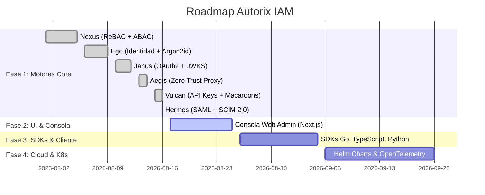

# Autorix: Arquitectura, Patrones y Roadmap a Producción

Autorix es un ecosistema moderno de **Identity and Access Management (IAM)**. Su filosofía radica en la **descentralización extrema, Zero Trust y el patrón de API Headless**. Cada microservicio es un binario estático e independiente en Go, con su propio almacén de datos, evitando el acoplamiento y los cuellos de botella de bases de datos compartidas.

---

## 1. Topología de Microservicios

La suite consta de 6 motores principales, inspirados en la arquitectura de ORY pero mejorados con capacidades híbridas y despliegues modernos:

```text
                                         [ TRÁFICO EXTERNO ]
                                                  │
                                                  ▼
                                       ┌─────────────────────┐
                                       │    Autorix Aegis    │  (Zero Trust Access Proxy :4455)
                                       └──────────┬──────────┘
                                                  │
       ┌──────────────────────┬───────────────────┼───────────────────┬──────────────────────┐
       ▼                      ▼                   ▼                   ▼                      ▼
┌──────────────┐       ┌──────────────┐    ┌──────────────┐    ┌──────────────┐       ┌──────────────┐
│Autorix Janus │       │Autorix Nexus │    │ Autorix Ego  │    │Autorix Vulcan│       │Autorix Hermes│
│(OAuth2/OIDC) │       │(ReBAC / ABAC)│    │(Identity/MFA)│    │ (API Keys)   │       │ (SAML / SCIM)│
│    :4444     │       │    :50051    │    │    :4433     │    │    :4466     │       │    :4477     │
└──────────────┘       └──────────────┘    └──────────────┘    └──────────────┘       └──────────────┘
```

| Microservicio | Puerto | Protocolo | Equivalente ORY | Responsabilidad Core |
| :--- | :--- | :--- | :--- | :--- |
| **Autorix Nexus** | `50051` | gRPC | ORY Keto + Zanzibar | Motor de Autorización Híbrido ReBAC (Zanzibar) + ABAC (Google CEL). |
| **Autorix Ego** | `4433` | REST | ORY Kratos | Identidad, ciclo de vida de usuarios, hashing Argon2id y sesiones. |
| **Autorix Janus** | `4444` | REST / OIDC | ORY Hydra | Servidor OAuth 2.0 y OpenID Connect con PKCE y claves asimétricas JWKS. |
| **Autorix Aegis** | `4455` | HTTP Proxy | ORY Oathkeeper | Zero Trust Identity & Access Proxy / PEP perimetral. |
| **Autorix Vulcan** | `4466` | REST | ORY Talos | API Keys seguras con prefijo y tokens de capacidad Macaroons. |
| **Autorix Hermes** | `4477` | REST / XML | ORY Polis | Puente SAML 2.0 a OIDC y servidor de sincronización de directorios SCIM 2.0. |

---

## 2. Stack Tecnológico y Patrones

### Tecnologías Core
- **Lenguaje:** Go (Golang). Excepcional concurrencia (goroutines) y binarios estáticos sin dependencias.
- **Base de Datos:** PostgreSQL 16 (aislada por microservicio). Índices GIN (`jsonb_path_ops`) y B-Tree.
- **Criptografía:** Argon2id (Contraseñas), RSA 2048-bit (JWKS/JWT), HMAC-SHA256 (Macaroons).
- **Reglas Dinámicas:** Google CEL (Common Expression Language) para ABAC en microsegundos.
- **Transporte:** gRPC con Protobufs (interno) y REST / JSON / XML (externo).

### Patrones de Diseño
1. **Arquitectura Hexagonal (Ports & Adapters):** Dominio completamente desacoplado de bases de datos y frameworks web.
2. **Zero Trust Network Architecture (ZTNA):** Los microservicios no confían ciegamente entre sí. Aegis actúa como PEP y elimina credenciales externas.
3. **Database-per-Service:** Cada servicio posee su propia base de datos (`autorix_nexus`, `autorix_ego`, `autorix_janus`, `autorix_vulcan`, `autorix_hermes`).
4. **12-Factor App:** Configuración 100% inyectable por variables de entorno y shutdown graceful.

---

## 3. Estado del Roadmap a Producción



### ✅ Fase 1: Los 6 Motores Core (COMPLETADA - 100%)
- [x] **Autorix Nexus**: Motor de grafos ReBAC concurrente con goroutines y evaluador CEL para ABAC (`:50051` gRPC).
- [x] **Autorix Ego**: Gestión de usuarios, perfiles dinámicos JSON Schema, hashing Argon2id y sesiones (`:4433` REST).
- [x] **Autorix Janus**: Servidor OAuth 2.0 y OIDC Headless, rotación de claves JWKS (`/.well-known/jwks.json`) y PKCE S256 (`:4444` REST).
- [x] **Autorix Aegis**: Reverse proxy Zero Trust con pipeline de 3 etapas (`Authenticators` -> `Authorizers` -> `Mutators`) y matcher de reglas (`:4455`).
- [x] **Autorix Vulcan**: API Keys con prefijo identificable (`av_live_...`) y Macaroons atenuables localmente (`:4466` REST).
- [x] **Autorix Hermes**: Puente SAML 2.0 (Service Provider para Okta/Azure AD) y servidor SCIM 2.0 RFC 7644 (`:4477` REST/XML).
- [x] **Testing**: 100% de tests unitarios y de integración pasando sin errores.
- [x] **Docker Compose**: Orquestación multi-servicio con PostgreSQL y bases de datos aisladas.
- [x] **Documentación Técnica**: Manual maestro de APIs y guías individuales en `/docs`.

---

### 🚀 Fase 2: Panel de Control Web y UI Administrativa (Siguiente Paso)
*Objetivo: Brindar una interfaz visual moderna e interactiva para administradores y desarrolladores.*
- [ ] Desarrollar **Autorix Console** en Next.js (App Router) + TailwindCSS.
- [ ] Visualizador interactivo de grafos de permisos para Nexus (Zanzibar Graph Explorer).
- [ ] Pantallas de autoservicio de Ego (Login, Registro, Recuperación y MFA).
- [ ] Gestor de clientes OAuth2 para Janus y creador de API Keys para Vulcan.

---

### 📦 Fase 3: SDKs de Integración para Desarrolladores
*Objetivo: Facilitar la adopción en cualquier stack tecnológico.*
- [ ] `@autorix/sdk-js` / `@autorix/react`: Cliente TypeScript para SPAs y Node.js.
- [ ] `autorix-go`: SDK nativo en Go con interceptores gRPC y middleware HTTP.
- [ ] `autorix-python`: SDK para FastAPI y Django.

---

### 🌐 Fase 4: Observabilidad y Despliegue en Kubernetes (Hardening)
*Objetivo: Preparar la infraestructura para escala masiva y alta disponibilidad.*
- [ ] Instrumentación con **OpenTelemetry** (traces distribuidos entre Aegis -> Janus -> Nexus).
- [ ] Métricas de **Prometheus** (`/metrics`) en todos los binarios.
- [ ] **Helm Charts** oficiales para Kubernetes con HPA (Horizontal Pod Autoscaler).
- [ ] Caché distribuida e invalidación de permisos en tiempo real vía **Redis Pub/Sub**.
- [ ] Pipelines de CI/CD automatizados en **GitHub Actions** (linting, testing, docker build, release tags).
